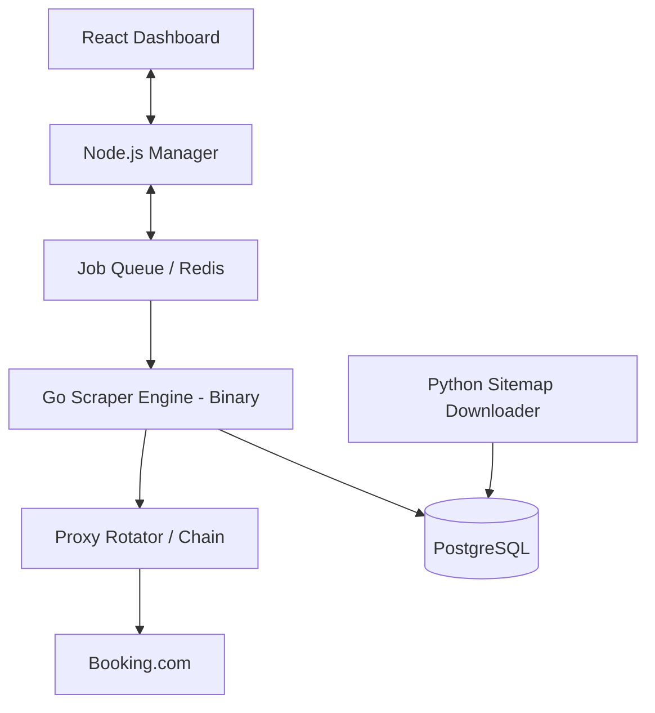

# ScrapeBookingCom

> **High-Performance Booking.com Scraper Engine & Dashboard**

[](https://opensource.org/licenses/MIT)
[](https://go.dev/)
[](https://www.python.org/)
[](https://react.dev/)

**ScrapeBookingCom** is a high-performance scraping ecosystem designed for high-concurrency data extraction. It combines a high-performance Go-based core engine with a sophisticated Node.js orchestration layer and a real-time React dashboard, that allows for +90req/s on a cheap vps and a large proxy list. 

---

## Key Features

- **High-Performance Core**: Go-based engine capable of handling thousands of concurrent requests.
- **Anti-Bot Sophistication**: Advanced fingerprinting and proxy rotation (SOCKS5/HTTP/Chain).
- **Real-time Monitoring**: Premium React dashboard with live metrics, speed tracking, and error reporting.
- **Sitemap Intelligence**: Optimized Python downloader for massive-scale discovery of hotel URLs.
- **Docker-Ready**: Orchestrated with Docker Compose for seamless deployment.

---

## Architecture



---

## Repository Structure

- `/bin`: Contains the compiled High-Performance Scraper Engine (Linux x64).
- `/api`: Node.js orchestration layer and metrics tracking.
- `/scripts`: Python sitemap discovery tools.
- `/web`: Premium React UI components for the dashboard.
- `docker-compose.yml`: Production-ready orchestration.

---

## Getting Started

### Prerequisites

- Docker & Docker Compose
- PostgreSQL (included in Compose)

### Installation

1. **Clone the repository**:
   ```bash
   git clone https://github.com/nbadino/ScrapeBookingCom.git
   cd ScrapeBookingCom
   ```
2. **Configure Environment**:
   Edit `docker-compose.yml` to include your proxies and database credentials.

3. **Launch the stack**:
   ```bash
   docker-compose up -d
   ```

4. **Access the Dashboard**:
   Open `http://localhost:5173` to see your scraper in action.

---

## Core Engine

The core scraper engine is provided as a pre-compiled high-performance binary in the `/bin` directory. This engine is optimized for:
- Efficient memory usage.
- High-concurrency Colly-based harvesting.
- Advanced WAF / Bot-detection bypass patterns.

*Note: For intellectual property reasons, the source code of the refined Go core is not public.*

---

## Legal & Ethical Note

This tool is for **educational and research purposes only**. Users are responsible for complying with Booking.com's Terms of Service and local data privacy laws. Always use scrapers ethically and respect `robots.txt` where possible.

---

<p align="center">
  Developed by <a href="https://github.com/nbadino">nbadino</a>
</p>
